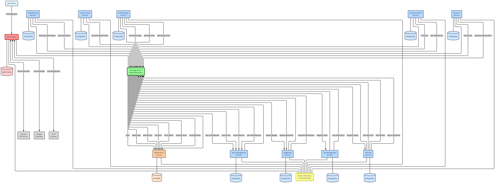

# FAF Management Platform

## Table of Contents
- [Service Boundaries](#service-boundaries)
    - [Services Overview](#services-overview)
    - [Architecture Diagram](#architecture-diagram)
- [Technologies and Communication](#technologies-and-communication)
- [Communication Contract](#communication-contract)
  -  [Data Management Across Services](#data-management-across-services)
  -  [Endpoints Definition](#endpoints-definition)
  - [Services Endpoints](#services-eps)
    - [1. User Management Service](#1-user-management-service)
    - [2. Notification Service](#2-notification-service)
    - [3. Tea Management Service](#3-tea-management-service)
    - [4. Communication Service](#3-communication-service)
    - [5. Booking Service](#5-booking-service)
    - [6. Check-in Service](#6-check-in-service)
    - [7. Lost & Found Service](#7-lost--found-service-lfs)
    - [8. Budgeting Service](#8-budgeting-service-bs)
    - [9. Fund Raising Service](#9-fund-raising-service-frs)
    - [10. Sharing Service](#10-sharing-service-shs)
- [GitHub Workflow](#github-workflow)
  - [Branch Naming Convention](#branch-naming-convention)
  - [Branch Rules](#branch-rules)
  - [Contribution Rules](#contribution-rules)
- [Running Services with Docker Compose](#running-services-with-docker-compose)
- [Accessing Services](#accessing-services)
- [Technical Architecture](#technical-architecture)
  - [Saga Pattern & Distributed Transactions](#saga-pattern--distributed-transactions)
  - [Database Replication Architecture](#database-replication-architecture)
  - [Cache Sharding & Strategies](#cache-sharding--strategies)

[//]: # (## Running)

[//]: # ()
[//]: # (To run the services using Docker Compose, follow these steps:)

[//]: # ()
[//]: # (1. **Create a `.env` file** in the root of the project with the following variables:)

[//]: # ()
[//]: # (```env)

[//]: # (LFS_POSTGRES_DB=lostfound-service-db)

[//]: # (LFS_POSTGRES_USER=postgres)

[//]: # (LFS_POSTGRES_PASSWORD=password)

[//]: # (LFS_POSTGRES_PORT=5432)

[//]: # (LFS_SERVICE_PORT=7777)

[//]: # ()
[//]: # (BS_POSTGRES_DB=budgeting-service-db)

[//]: # (BS_POSTGRES_USER=postgres)

[//]: # (BS_POSTGRES_PASSWORD=password)

[//]: # (BS_POSTGRES_PORT=5433)

[//]: # (BS_SERVICE_PORT=7778)

[//]: # (```)

[//]: # ()
[//]: # (2. **Start the services** using Docker Compose:)

[//]: # ()
[//]: # (```bash)

[//]: # (docker-compose up --build)

[//]: # (```)

[//]: # ()
[//]: # (* Wait for PostgreSQL to be ready before starting the Lost & Found service)

[//]: # ()
[//]: # (3. **Access the API**)

[//]: # ()
[//]: # (- Lost Found Service API: [`http://localhost:7777/api/lfs`]&#40;http://localhost:7777/api/lfs&#41;  )

[//]: # (- Budgeting Service API: [`http://localhost:7778/api/bs`]&#40;http://localhost:7778/api/bs&#41;)

[//]: # ()
[//]: # (---)

[//]: # ()
[//]: # (Here’s a concise README section for your seeding instructions:)

[//]: # ()
[//]: # (## Seeding)

[//]: # ()
[//]: # (### 1. Lost & Found Service)

[//]: # ()
[//]: # (To populate the Lost & Found database with initial data:)

[//]: # ()
[//]: # (1. Open a terminal in the repo.  )

[//]: # (2. Run the seeding script and specify the deployed service URL:)

[//]: # ()
[//]: # (```powershell)

[//]: # (.\seed\lostfound-service\seed.bat http://localhost:7777)

[//]: # (```)

[//]: # ()
[//]: # (* Replace `http://localhost:7777` with the actual URL if your service is running elsewhere.)

[//]: # ()
[//]: # (### 2. Budgeting Service)

[//]: # ()
[//]: # (To populate the Budgeting database with initial data:)

[//]: # ()
[//]: # (1. Open a terminal in the repo.  )

[//]: # (2. Run the seeding script and specify the deployed service URL:)

[//]: # ()
[//]: # (```powershell)

[//]: # (.\seed\budgeting-service\seed.bat http://localhost:7778)

[//]: # (```)

[//]: # ()
[//]: # (* Replace `http://localhost:7778` with the actual URL if your service is running elsewhere.)

[//]: # ()
[//]: # (## Service Location)

[//]: # ()
[//]: # (### Lost Found Service)

[//]: # ()
[//]: # (The Lost Found Service is available on Docker Hub: [lumijiez/lostfound-service]&#40;https://hub.docker.com/r/lumijiez/lostfound-service&#41;)

[//]: # ()
[//]: # (For setup instructions, refer to the `.env.example` file to see how to configure the necessary environment variables.)

[//]: # ()
[//]: # (---)

## Service Boundaries

### Services Overview
| Service Name | Core Responsibilities (Boundaries) |
| :--- | :--- |
| **User Management** | • Handles user registration, login and authentication.<br>• Stores user profiles (name, nickname, group, role).<br>• Central source of truth for user identity. <br>• Integrates with Discord API to fetch user data. |
| **Notification** | • Handles all outgoing communications (e.g., email, Discord DMs).<br>• Sends alerts based on events from other services (e.g., low supplies, new bookings).<br>• Ensures timely and targeted delivery of messages. |
| **Tea Management** | • Tracks inventory levels of all consumables (tea, sugar, cups, markers).<br>• Logs which user consumes which items and when.<br>• Triggers notifications for low stock or excessive resource usage. |
| **Communication** | • Facilitates real-time chat between users (public and private channels).<br>• Allows users to find each other by nickname.<br>• Enforces communication rules through word censorship and user bans. |
| **Cab Booking** | • Manages the schedule for bookable spaces (main room, kitchen).<br>• Prevents scheduling conflicts.<br>• Integrates with Google Calendar to sync events. |
| **Check-in** | • Tracks user presence inside FAF Cab by processing entry and exit events.<br>• Manages a log of one-time guest registrations.<br>• Identifies and alerts admins about unrecognized individuals. |
| **Lost & Found** | • Manages user-generated posts about lost or found items.<br>• Supports comment threads for discussion on each post.<br>• Allows the original poster to mark an issue as resolved. |
| **Budgeting** | • Tracks all financial transactions (donations, spending).<br>• Maintains the FAF NGO treasury balance and a public log.<br>• Manages a debt book for property damage or overuse.<br>• Allows admins to generate financial reports in CSV format. |
| **Fund Raising** | • Allows admins to create and manage fundraising campaigns for specific items.<br>• Tracks user donations towards a goal within a set timeframe.<br>• Orchestrates the registration of newly acquired items into other relevant services (e.g., Sharing, Budgeting). |
| **Sharing** | • Manages the inventory of multi-use, non-consumable items (games, cables, kettles).<br>• Handles the "renting" and "returning" lifecycle of shared objects.<br>• Tracks the state/condition of each item and its ownership (personal or FAF). |
| 
<p align="right"><i>Table 1 – Services Boundaries</i></p>

## Architecture Diagram


<p align="right"><i>Figure 1 – Architecture Diagram</i></p>

## Technologies and Communication

|   | Services                       | Student Assigned    | Language/Framework   | DB                             | Motivation | Trade-offs         |
|---|--------------------------------|---------------------|----------------------|--------------------------------|------------|--------------------|
| 1 | User Management & Notification | Colța Maria         | Typescript (Nest.js) | PostgreSQL | Nest.js offers good structure for organizing code, catches errors early, works well with Discord API. PosgresSQL is a reliable data storage, good for handling user relationships and permissions. | Nest.js takes more time to learn than simpler frameworks, but makes code easier to maintain. PostgresSQL has a higher resource usage vs NoSQL, but is necessary for consistent relationships. |
| 2 | Tea Management & Communication | Munteanu Ecaterina  | Golang ()            |  Postgresql  |           Go provides simplicity, speed, and strong concurrency support, which fits well for logging many small consumption events. PostgreSQL offers strong relational handling and reporting features, making it ideal for tracking consumables and user usage history. REST with JSON ensures smooth interoperability with other FAFCab services. | Go requires more manual coding for things like validation and ORM compared to heavier frameworks, but in return you get lightweight, performant services with low resource usage and easy deployment.
| 3 | Cab Booking & Check-in         | Friptu Ludmila      | Node.js (Express.js) | PostgreSQL, MongoDB            | Node.js handles I/O-heavy tasks and real-time camera check-ins with its event-driven, non-blocking model. PostgreSQL provides ACID reliability to prevent double-bookings, while MongoDB’s flexible schema and fast writes suit large volumes of time-series logs (check-ins/check-outs). | The single-threaded nature of Node.js makes CPU-heavy tasks (e.g., video or ML processing) inefficient unless you offload them to worker processes or native modules. PostgreSQL comes with a more rigid schema model and greater complexity when scaling horizontally or handling very high write volumes. MongoDB lacks the same relational constraints and strict consistency. |
| 4 | Lost & Found & Budgeting       | Schipschi Daniel    | C# (ASP.NET Core)    | PostgreSQL                     | C# provides excellent decimal handling for financial calculations and strong type safety for money operations. ASP.NET Core offers robust validation and security features essential for financial data. PostgreSQL ensures ACID compliance for transaction integrity and supports full-text search for Lost & Found posts. | Heavier resource usage compared to lighter frameworks. More complex setup and deployment process. Less flexibility for rapid prototyping compared to dynamic languages. |
| 5 | Fund Raising & Sharing         | Novac Felicia       | C# (ASP.NET Core)    | PostgreSQL                     | ASP.NET Core with PostgreSQL offers reliability, security, and strong transactional guarantees, well suited for handling financial and resource-sharing workflows.           | Adds overhead in schema management and is heavier compared to lighter frameworks, which can slow iteration and increase resource usage.      |
<p align="right"><i>Table 2 – Services & Technologies</i></p>

We've chosen **REST over HTTP** as the communication pattern for all the services, because it's quite simple, widely supported, especially across the three chosen stacks. It matches the needs of our business case, such that services must expose predictable, resource-oriented APIs. In this case, we'll also benefit from its _stateless_ nature, where each call will already contain all the necessary context, simplifying future scaling as mentioned. In addition, REST integrates well with _Swagger_, making it easier to document and test, which in our case is very important you know :)
But of course there are trade-offs. REST is not optimal for real-time features, as in our case is the Communication Service, since it lacks streaming or push support. It also increases coupling because services must call each other directly to complete workflows. Even so, given that most of our operations are transactional, we're ok )

## Communication Contract

### Data Management Across Services

We've decided that each microservice will be responsible for its own data and will maintain a separate database schema. No service has direct access to another service's database, instead, data is shared strictly through REST APIs exposed by each service. In this case, each domain entity will be owned exclusively by its responsible service, and when another service will need that data - it will issue a REST request to the owning service.

### Endpoints Definition
All the services in the FAF Cab Management Platform expose RESTful HTTP APIs. They follow consistent "conventions" to keep it easy to integrate with each other.

**Some general conventions:**

* Each service is mounted under `/api/{service}`, where `{service}` is a shortened identifier (e.g., `/api/frs` = Fund Raising Service).

* Requests use `Authorization: Bearer <JWT> issued by the User Management Service. Role checks are enforced per EP.

* All requests and responses use `application/json` content type.

* All datetime fields use `ISO 8601` format in **UTC**.

* Common established error JSON shape: 
````json 
{ 
  "error": "VALIDATION_ERROR", 
  "message": "field X is required"
}
````

## Services EPs

### 1. User Management Service
#### Base URL: /users
#### Entities:
- **User** - registered or potential user in the FAF Cab Management Platform.
- **OTP** - handles OTP verification for user registration process.
#### Query parameters:
- **page** (optional) - Page number for pagination (default: 1)
- **limit** (optional) - Number of users per page (default: 10)
- **username** (optional) - Filter by username (partial match)
- **nickname** (optional) - Filter by nickname (partial match)
- **roles** (optional) - Filter by roles (user must have all specified roles)

#### EP List:
| Method | Path                   | Auth   | Purpose                                    |
| ------ | ---------------------- | ------ | ------------------------------------------ |
| GET    | /users                 | user   | Get the list of all users with pagination and filters |
| GET    | /users/:username       | user   | Get a specific user by username            |
| POST   | /users/login           | public | Login a user to the system                 |
| POST   | /users/otp             | public | Request OTP for registration or password update |
| POST   | /users/register        | public | Register a new user or update password     |

<p align="right"><i>Table 3 – User Management Service Endpoints</i></p>

#### GET /users
- *Response 200:*
```json
{
  "data": [
    {
      "id": "153120398123335680",
      "nickname": "masha0498",
      "global_name": "Masha",
      "username": "masha0498",
      "roles": [
        "856619346419122177",
        "856646165398814722"
      ]
    }
  ],
  "page": 0,
  "limit": 0,
  "total": 0,
  "totalPages": 0
}
```
- *Errors:* 401 Unauthorized, 429 Too many requests

#### GET /users/:username
- *Response 200:*
```json
  {
  "id": "153120398123335680",
  "nickname": "masha0498",
  "global_name": "Masha",
  "username": "masha0498",
  "roles": [
    "856619346419122177",
    "856646165398814722"
  ]
}
```
- *Errors:* 401 Unauthorized, 404 Not Found, 429 Too many requests

#### POST /users/login
- *Request:*
```json
  {
    "username": "string",
    "password": "string",
  }
```

- *Response 200:*
```json
{
  "token": "string",
  "user": {
    "id": "153120398123335680",
    "nickname": "Marcel",
    "global_name": "Marcelo",
    "username": "vlasencom",
    "roles": [
      "856619346419122177",
      "856646165398814722"
    ]
  }
}
```
- *Errors:* 401 Invalid Credentials, 429 Too many requests 

#### POST /users/otp
- *Request:*
```json
  {
    "username": "string"
  }
```

- *Response 200:*
```json
  {
    "success": true,
    "message": "string"
  }
```
- *Errors:* 404 Not Found (User not found in Discord), 429 Too Many Requests 

#### POST /users/register
- *Request:*
```json
  {
    "username": "string",
    "otp": "string",
    "password": "string"
  }
```

- *Response 201:*
```json
{
  "token": "string",
  "user": {
    "id": "153120398123335680",
    "nickname": "Marcel",
    "global_name": "Marcelo",
    "username": "vlasencom",
    "roles": [
      "856619346419122177",
      "856646165398814722"
    ]
  }
}
```
- *Errors:* 401 Unauthorized (Invalid or expired OTP), 404 Not Found (User not found), 429 Too Many Requests 

### 2. Notification Service
#### Base URL: /api/ntf

#### EP List:
| Method | Path                   | Auth   | Purpose                                    |
| ------ | ---------------------- | ------ | ------------------------------------------ |
| POST   | /notifications         | admin  | Send notification to the right persion     |

<p align="right"><i>Table 4 – Notification Service Endpoints</i></p>

#### POST /send_notification
- *Request:*
```json
{
  "type": "dm",
  "user_id": "427518893930709012",
  "channel_name": "〘🚪〙faf-cab-playground",
  "message": "Hello! This is a notification from the service."
}
```

- *Response 200:*
```json
{
  "type": "dm",
  "user_id": "427518893930709012",
  "channel_name": "〘🚪〙faf-cab-playground",
  "message": "Hello! This is a notification from the service.",
  "channel_id": "1423957940125306983",
  "message_id": "1423960195394174986",
  "timestamp": "2025-10-04T09:09:26.483000+00:00"
}
```
- *Errors:* 400 Bad Request, 401 Unauthorized, 403 Forbidden 


### 3. Tea Management Service
#### Base URL: /api/tms
#### Entities:
- **Consumable** - represents an item like tea, sugar, cups, paper, etc.
- **ConsumptionLog** - record of when a user consumes a consumable.
- **ThresholdAlert** - triggered when consumables run low or a user exceeds fair use.

#### EP List:
| Method | Path                   | Auth   | Purpose                                    |
| ------ | ---------------------- | ------ | ------------------------------------------ |
| POST   | /consumables           | admin  | Add a new consumable item                  |
| GET    | /consumables           | public | List all consumables with stock levels     |
| GET    | /consumables/{id}      | public | Get details of a consumable                |
| PUT    | /consumables/{id}      | admin  | Update stock levels or details             |
| POST   | /consumptions          | user   | Log a consumption event                    |
| GET    | /consumptions          | admin  | View all consumption logs                  |
| GET    | /consumptions/{userId} | admin  | View consumption logs by user              |
| GET    | /alerts                | admin  | List triggered alerts (low stock, overuse) |

<p align="right"><i>Table 5 – Tea Management Service Endpoints</i></p>

#### POST /consumables
- *Request:*
```json
{
  "name": "Tea Bags",
  "unit": "bags",
  "stock": 200,
  "lowStockThreshold": 20
}
```
- *Response 201:*
```json
{
  "id": "uuid",
  "name": "Tea Bags",
  "unit": "bags",
  "stock": 200,
  "lowStockThreshold": 20,
  "createdAt": "ISO Date",
  "updatedAt": "ISO Date"
}
```
- *Errors:* 400 Bad Request, 401 Unauthorized, 403 Forbidden 

#### GET /consumables
- *Response 200:*
```json
{
  "consumables": [
    {
      "id": 0,
      "name": "Tea Bags",
      "unit": "bags",
      "stock": 150,
      "lowStockThreshold": 20,
      "updatedAt": "ISO Date"
    }
  ]
}
```
- *Errors:* 401 Unauthorized 

#### GET /consumables/{id}
*Response 200:*
```json
{
  "id": "3f9c07f2-8d3d-45a6-90b2-7c37e7c62a2f",
  "name": "Tea Bags",
  "unit": "bags",
  "stock": 150,
  "lowStockThreshold": 20,
  "createdAt": "2025-09-01T10:00:00Z",
  "updatedAt": "2025-09-11T14:00:00Z"
}
```
- *Errors:* 400 Bad Request, 404 Not Found

#### PUT /consumables/{id}
- *Request:*
```json
{
  "stock": 180
}
```
- *Response 200:*
```json
{
  "id": 0,
  "name": "Tea Bags",
  "unit": "bags",
  "stock": 180,
  "lowStockThreshold": 20,
  "updatedAt": "ISO Date"
}
```
- *Errors:* 400 Bad Request, 401 Unauthorized, 403 Forbidden, 404 Not Found

#### POST /consumptions
- *Request:*
```json
{
  "userId": 42,
  "consumableId": 0,
  "amount": 3
}

```
- *Response 201:*
```json
{
  "id": 0,
  "userId": 42,
  "consumableId": 0,
  "amount": 3,
  "createdAt": "ISO Date"
}
```
- *Errors:* 400 Bad Request, 401 Unauthorized, 403 Forbidden, 404 Not Found

#### GET /consumptions
- *Response 200:*
```json
{
  "logs": [
    {
      "id": "6b77216c-39e8-4ef9-b2f1-4a7c24d3428e",
      "userId": "5f8b6c3e-0e29-4d7b-a6f1-68eae87c73f3",
      "consumableId": "3f9c07f2-8d3d-45a6-90b2-7c37e7c62a2f",
      "amount": 2,
      "createdAt": "2025-09-11T12:00:00Z"
    },
    {
      "id": "ab12d3e4-f6c7-48b9-8d1a-2c3d4e5f6789",
      "userId": "2c9a6bff-1a3e-4c9b-9d5c-123456789abc",
      "consumableId": "3f9c07f2-8d3d-45a6-90b2-7c37e7c62a2f",
      "amount": 1,
      "createdAt": "2025-09-11T11:45:00Z"
    }
  ]
}
```
- *Errors:* 400 Bad Request, 401 Unauthorized, 403 Forbidden

#### GET /consumptions/{userId}
- *Response 200:*
```json
{
  "logs": [
    {
      "id": 0,
      "userId": 42,
      "consumableId": 0,
      "amount": 3,
      "createdAt": "ISO Date"
    }
  ]
}
```
- *Errors:* 400 Bad Request, 401 Unauthorized, 403 Forbidden, 404 Not Found

#### GET /alerts
- *Response 200:*
```json
{
  "alerts": [
    {
      "id": 0,
      "type": "LOW_STOCK",
      "consumableId": 0,
      "currentStock": 10,
      "threshold": 20,
      "createdAt": "ISO Date"
    },
    {
      "id": 1,
      "type": "OVERUSE",
      "userId": 42,
      "consumableId": 0,
      "amountUsed": 50,
      "limit": 20,
      "createdAt": "ISO Date"
    }
  ]
}
```
- *Errors:* 401 Unauthorized, 403 Forbidden
### 4. Communication Service
#### Base URL: /api/tms
#### Entities:
- **Chat** - represents a public or private conversation between users.
- **Message** - a message sent by a user in a chat.
- **Ban** - a moderation action applied to a user (global or per-chat).
- **BannedWord** - represents a word blocked by censorship rules.

#### EP List:
| Method | Path                 | Auth  | Purpose                                         |
| ------ | -------------------- | ----- | ----------------------------------------------- |
| POST   | /chats               | user  | Create a chat (public or private, with members) |
| GET    | /chats/{id}          | user  | Get chat details (members, type)                |
| GET    | /chats               | user  | List chats user participates in                 |
| POST   | /chats/{id}/messages | user  | Send a message to a chat                        |
| GET    | /chats/{id}/messages | user  | Get messages in a chat                          |
| POST   | /bans                | admin | Ban a user (timed or permanent)                 |
| GET    | /bans                | admin | List active bans                                |
| POST   | /censorship/words    | admin | Add a banned word                               |
| GET    | /censorship/words    | admin | List banned words                               |

#### POST /chats
- *Request:*
```json
{
  "name": "Study Group",
  "type": "PUBLIC",             // or "PRIVATE"
  "memberIds": ["uuid1", "uuid2"]
}
```
- *Response 201:*
```json
{
  "id": "uuid-chat",
  "name": "Study Group",
  "type": "PUBLIC",
  "members": ["uuid1", "uuid2"],
  "createdBy": "uuid-creator",
  "createdAt": "ISO Date"
}
```
- *Errors:* 400 Bad Request, 401 Unauthorized, 404 Not Found, 409 Conflict
#### GET /chats/{id}
- *Response 200:*
```json
{
  "id": "uuid-chat",
  "name": "Study Group",
  "type": "PUBLIC",
  "members": ["uuid1", "uuid2"],
  "createdBy": "uuid-creator",
  "createdAt": "ISO Date"
}
```
- *Errors:* 401 Unauthorized, 403 Forbidden, 404 Not Found
#### GET /chats
- *Response 200:*
```json
{
  "chats": [
    {
      "id": "uuid-chat1",
      "name": "Study Group",
      "type": "PUBLIC",
      "lastMessageAt": "ISO Date"
    },
    {
      "id": "uuid-chat2",
      "name": "Private DM",
      "type": "PRIVATE",
      "lastMessageAt": "ISO Date"
    }
  ]
}
```
- *Errors:* 401 Unauthorized
#### POST /chats/{id}/messages
- *Request:*
```json
{
  "senderId": "uuid1",
  "content": "This message will be filtered!"
}
```
- *Response 201:*
```json
{
  "id": "uuid-message",
  "chatId": "uuid-chat",
  "senderId": "uuid1",
  "content": "This message will be filtered!",
  "censored": false,
  "createdAt": "ISO Date"
}
```
- *Errors:* 400 Bad Request, 401 Unauthorized, 403 Forbidden, 404 Not Found
#### GET /chats/{id}/messages
- *Response 200:*
```json
{
  "messages": [
    {
      "id": "uuid-message1",
      "senderId": "uuid1",
      "content": "Hello!",
      "censored": false,
      "createdAt": "ISO Date"
    },
    {
      "id": "uuid-message2",
      "senderId": "uuid2",
      "content": "***",
      "censored": true,
      "createdAt": "ISO Date"
    }
  ]
}
```
- *Errors:* 401 Unauthorized, 403 Forbidden, 404 Not Found
#### POST /bans
- *Request:*
```json
{
  "userId": "uuid-user",
  "chatId": "uuid-chat",       // optional, null = global ban
  "type": "TEMPORARY",         // or "PERMANENT"
  "duration": "PT24H"          // ISO 8601 duration for temporary bans
}
```
- *Response 201:*
```json
{
  "id": "uuid-ban",
  "userId": "uuid-user",
  "chatId": "uuid-chat",
  "type": "TEMPORARY",
  "duration": "PT24H",
  "createdAt": "ISO Date"
}
```
- *Errors:* 400 Bad Request, 401 Unauthorized, 403 Forbidden, 404 Not Found, 409 Conflict
#### GET /bans
- *Response 200:*
```json
{
  "bans": [
    {
      "id": "uuid-ban",
      "userId": "uuid-user",
      "chatId": "uuid-chat",
      "type": "TEMPORARY",
      "expiresAt": "ISO Date"
    }
  ]
}
```
- *Errors:* 401 Unauthorized, 403 Forbidden
#### POST /censorship/words
- *Request:*
```json
{
  "word": "spoiler"
}
```
- *Response 201:*
```json
{
  "id": "uuid-word",
  "word": "spoiler",
  "createdAt": "ISO Date"
}
```
- *Errors:* 400 Bad Request, 401 Unauthorized, 403 Forbidden, 409 Conflict
#### GET /censorship/words
- *Response 200:*
```json
{
  "words": [
    {
      "id": "uuid-word1",
      "word": "spoiler"
    },
    {
      "id": "uuid-word2",
      "word": "curse"
    }
  ]
}
```
- *Errors:* 401 Unauthorized, 403 Forbidden

### 5. Booking Service
#### Base URL: /api/bs

#### EP List:
| Method | Path                   | Auth   | Purpose                                    |
| ------ | ---------------------- | ------ | ------------------------------------------ |
| POST   | /bookings              | user   | Creates a new booking for a room.          |
| DELETE | /bookings/{bookingId}  | user   | Cancels a specific booking.                |

<p align="right"><i>Table 6 – Booking Service Endpoints</i></p>

### Synchronous Communication (REST API)

#### `POST /bookings`

**Query Parameters:**
- `start` (optional): start time
- `end` (optional): end time

- *Request:*
```json
{
  "userId": "string",
  "room": "string",
  "startTime": "datetime",
  "endTime": "datetime"
}
```

- *Response (201 Created):*

```json
  {
    "bookingId": "string",
    "userId": "string",
    "room": "string",
    "startTime": "datetime",
    "endTime": "datetime",
    "createdAt": "datetime"
  }
```

- *Error* 400 Bad Request, 409 Conflict (time slot taken)

#### `GET /bookings?start={date}&end={date}`

Gets all bookings within a specified date range.
- *Response (200 OK):*
```json
  [
    {
      "bookingId": "string",
      "userId": "string",
      "room": "string",
      "startTime": "datetime",
      "endTime": "datetime"
    }
  ]
```

#### `DELETE /bookings/{bookingId}`

- *Response (204 No Content)*
- *Error:* 403 Forbidden, 404 Not Found

### 6. Check-in Service

#### Base URL: /api/chs
#### EP List:
| Method | Path                                       | Auth   | Purpose                                    |
| ------ | ------------------------------------------ | ------ | ------------------------------------------ |
| POST   | /status/current                            | admin  | Gets a list of all users currently inside FAFCab.          |
| GET    | /history/{userId}?start={date}&end={date}  | admin  | Gets the entry and exit history for a specific user within a date range.  |
| POST   | /guest                                     | admin  | Registers a one-time guest.  |

<p align="right"><i>Table 7 – Check-in Service Endpoints</i></p>

### Synchronous Communication (REST API)

#### `GET /status/current`
- *Response (200 OK):*
```json
  [
    {
      "userId": "string",
      "nickname": "string",
      "checkInTime": "datetime"
    }
  ]
```

#### `GET /history/{userId}?start={date}&end={date}`
- *Response (200 OK):*
```json
  [
    {
      "event_type": "string",
      "timestamp": "datetime"
    }
  ]
```
- *Error:* 404 Not Found

#### `POST /guest`
- *Request Body:*
```json
  {
    "hostUserId": "string",
    "guestName": "string"
  }
```
- *Response (201 Created):*
```json
  {
    "guestLogId": "string",
    "guestName": "string",
    "hostUserId": "string",
    "entryTime": "datetime"
  }
```
*Error:* 400 Bad Request

### 7. Lost & Found Service (LFS)

**Base URL:** `/api/lfs`

**Entities:**
* `Post` — represents a lost or found item announcement with status and metadata
* `Comment` — represents a comment thread under a specific post

**Endpoints List:**

| Method | Path                     | Auth   | Purpose                         |
|--------|--------------------------|--------|---------------------------------|
| POST   | /posts                   | user   | Create a new lost/found post    |
| GET    | /posts                   | public | List all posts with filters     |
| GET    | /posts/{id}              | public | Get specific post details       |
| PATCH  | /posts/{id}              | user   | Update post (author/admin only) |
| POST   | /posts/{id}/comments     | user   | Add comment to a post           |
| GET    | /posts/{id}/comments     | public | Get all comments for a post     |
| PATCH  | /posts/{id}/resolve      | user   | Mark post as resolved           |

<p align="right"><i>Table 8 – Lost & Found Service Endpoints</i></p>

**Endpoints Specs:**

`POST /posts`

**Request:**
````json
{
  "type": "string (enum: LOST, FOUND)",
  "title": "string",
  "description": "string",
  "itemCategory": "string (enum: ELECTRONICS, CLOTHING, DOCUMENTS, BOOKS, OTHER)",
  "location": "string",
  "contactInfo": "string (optional)"
}
````

**Response 201:**
````json
{
  "id": "string",
  "type": "string (enum: LOST, FOUND)",
  "title": "string",
  "description": "string",
  "itemCategory": "string (enum: ELECTRONICS, CLOTHING, DOCUMENTS, BOOKS, OTHER)",
  "location": "string",
  "contactInfo": "string",
  "status": "string (enum: OPEN, RESOLVED)",
  "authorId": "string (userId)",
  "createdAt": "ISO Date",
  "updatedAt": "ISO Date"
}
````

`GET /posts`

**Query Parameters:**
- `type` (optional): LOST or FOUND
- `category` (optional): item category
- `status` (optional): OPEN or RESOLVED
- `limit` (optional): number of posts per page (default: 20)
- `offset` (optional): pagination offset (default: 0)

**Response 200:**
````json
{
  "posts": [
    {
      "id": "string",
      "type": "string (enum: LOST, FOUND)",
      "title": "string",
      "description": "string",
      "itemCategory": "string",
      "location": "string",
      "status": "string (enum: OPEN, RESOLVED)",
      "authorId": "string",
      "commentCount": 3,
      "createdAt": "ISO Date",
      "updatedAt": "ISO Date"
    }
  ],
  "total": 42
}
````

`GET /posts/{id}`

**Response 200:**
````json
{
  "id": "string",
  "type": "string (enum: LOST, FOUND)",
  "title": "string",
  "description": "string",
  "itemCategory": "string",
  "location": "string",
  "contactInfo": "string",
  "status": "string (enum: OPEN, RESOLVED)",
  "authorId": "string",
  "createdAt": "ISO Date",
  "updatedAt": "ISO Date"
}
````

`POST /posts/{id}/comments`

**Request:**
````json
{
  "content": "string"
}
````

**Response 201:**
````json
{
  "id": "string",
  "postId": "string",
  "authorId": "string (userId)",
  "content": "string",
  "createdAt": "ISO Date"
}
````

`GET /posts/{id}/comments`

**Response 200:**
````json
{
  "comments": [
    {
      "id": "string",
      "postId": "string",
      "authorId": "string",
      "content": "string",
      "createdAt": "ISO Date"
    }
  ]
}
````

`PATCH /posts/{id}/resolve`

**Request:**
````json
{
  "status": "RESOLVED"
}
````

**Response 200:**
````json
{
  "id": "string",
  "status": "RESOLVED",
  "updatedAt": "ISO Date"
}
````

-----

### 8. Budgeting Service (BS)

**Base URL:** `/api/bs`

**Entities:**
* `Transaction` — represents income or expense transaction with categorization
* `Balance` — current treasury balance for FAF Cab and FAF NGO
* `DebtEntry` — represents money owed by users for damages or overuse

**Endpoints List:**

| Method | Path                   | Auth   | Purpose                           |
|--------|------------------------|--------|-----------------------------------|
| GET    | /balance               | public | Get current treasury balance      |
| POST   | /transactions/income   | admin  | Record income transaction         |
| POST   | /transactions/expense  | admin  | Record expense transaction        |
| GET    | /transactions          | admin  | List all transactions with filters|
| GET    | /reports/csv           | admin  | Download financial report as CSV  |
| POST   | /debt                  | admin  | Add debt entry for user           |
| GET    | /debt                  | admin  | List all debt entries             |
| GET    | /debt/{userId}         | user   | Get debt for specific user        |
| PATCH  | /debt/{id}             | admin  | Update debt entry (mark paid)     |

<p align="right"><i>Table 9 – Budgeting Service Endpoints</i></p>

**Endpoints Specs:**

`GET /balance`

**Response 200:**
````json
{
  "fafCabBalance": {
    "amount": 1250.75,
    "currency": "MDL",
    "lastUpdated": "ISO Date"
  },
  "fafNgoBalance": {
    "amount": 3420.50,
    "currency": "MDL",
    "lastUpdated": "ISO Date"
  }
}
````

`POST /transactions/income`

**Request:**
````json
{
  "amount": 150.00,
  "currency": "string (enum: MDL, EUR, USD)",
  "source": "string (enum: FAF_DONATION, PARTNER_DONATION, FUNDRAISING, OTHER)",
  "description": "string",
  "fundTarget": "string (enum: FAF_CAB, FAF_NGO)",
  "referenceId": "string (optional - for linking to fundraising campaigns)"
}
````

**Response 201:**
````json
{
  "id": "string",
  "type": "INCOME",
  "amount": 150.00,
  "currency": "string",
  "source": "string",
  "description": "string",
  "fundTarget": "string",
  "referenceId": "string",
  "recordedBy": "string (userId)",
  "createdAt": "ISO Date"
}
````

`POST /transactions/expense`

**Request:**
````json
{
  "amount": 75.50,
  "currency": "string (enum: MDL, EUR, USD)",
  "category": "string (enum: CONSUMABLES, EQUIPMENT, MAINTENANCE, UTILITIES, OTHER)",
  "description": "string",
  "fundSource": "string (enum: FAF_CAB, FAF_NGO)",
  "receiptUrl": "string (optional)"
}
````

**Response 201:**
````json
{
  "id": "string",
  "type": "EXPENSE",
  "amount": 75.50,
  "currency": "string",
  "category": "string",
  "description": "string",
  "fundSource": "string",
  "receiptUrl": "string",
  "recordedBy": "string (userId)",
  "createdAt": "ISO Date"
}
````

`GET /transactions`

**Query Parameters:**
- `type` (optional): INCOME or EXPENSE
- `startDate` (optional): ISO date
- `endDate` (optional): ISO date
- `fundTarget` (optional): FAF_CAB or FAF_NGO
- `limit` (optional): default 50
- `offset` (optional): default 0

**Response 200:**
````json
{
  "transactions": [
    {
      "id": "string",
      "type": "string (enum: INCOME, EXPENSE)",
      "amount": 150.00,
      "currency": "string",
      "description": "string",
      "fundTarget": "string",
      "recordedBy": "string",
      "createdAt": "ISO Date"
    }
  ],
  "total": 156
}
````

`GET /reports/csv`

**Query Parameters:**
- `startDate` (required): ISO date
- `endDate` (required): ISO date
- `fundTarget` (optional): FAF_CAB or FAF_NGO

**Response 200:**
Returns CSV file with headers: `Date,Type,Amount,Currency,Description,Fund,RecordedBy`

`POST /debt`

**Request:**
````json
{
  "userId": "string",
  "amount": 50.00,
  "currency": "string (enum: MDL, EUR, USD)",
  "reason": "string (enum: DAMAGE, OVERUSE, LOST_ITEM, OTHER)",
  "description": "string",
  "itemId": "string (optional - reference to damaged item)"
}
````

**Response 201:**
````json
{
  "id": "string",
  "userId": "string",
  "amount": 50.00,
  "currency": "string",
  "reason": "string",
  "description": "string",
  "itemId": "string",
  "status": "string (enum: PENDING, PAID, FORGIVEN)",
  "createdBy": "string (userId)",
  "createdAt": "ISO Date",
  "updatedAt": "ISO Date"
}
````

`GET /debt`

**Query Parameters:**
- `status` (optional): PENDING, PAID, FORGIVEN
- `userId` (optional): filter by specific user

**Response 200:**
````json
{
  "debts": [
    {
      "id": "string",
      "userId": "string",
      "amount": 50.00,
      "currency": "string",
      "reason": "string",
      "description": "string",
      "status": "string",
      "createdAt": "ISO Date"
    }
  ],
  "totalPending": 125.75
}
````

`GET /debt/{userId}`

**Response 200:**
````json
{
  "userDebts": [
    {
      "id": "string",
      "amount": 50.00,
      "currency": "string",
      "reason": "string",
      "description": "string",
      "status": "string",
      "createdAt": "ISO Date"
    }
  ],
  "totalOwed": 50.00
}
````

`PATCH /debt/{id}`

**Request:**
````json
{
  "status": "string (enum: PAID, FORGIVEN)",
  "note": "string (optional)"
}
````

**Response 200:**
````json
{
  "id": "string",
  "status": "PAID",
  "note": "string",
  "updatedBy": "string (userId)",
  "updatedAt": "ISO Date"
}
````

-----

### 9. Fund Raising Service (FRS)
**Base URL:** `/api/frs`

**Entities:**
* `Initiative` — represents a fundraising effort for an object or consumable, with goal, deadline, and status
* `Donation` - a contribution made by a user to an initiative

**Endpoints List:**

| Method | Path                          | Auth       | Purpose                    |
|--------|-------------------------------|------------|----------------------------|
| POST   | /initiatives                  | admin      | Create fund                |
| GET    | /initiatives                  | public     | List all the funds         |
| GET    | /initiatives/{id}             | public     | Get fund by id             |
| POST   | /initiatives/{id}/donations   | user       | donate                     |
| GET    | /frs/initiative/{id}/donations| admin      | list donations for a fund  |
| POST   | /initiatives/{id}/finalize    | system use | finalize fund              |

<p align="right"><i>Table 10 – Fund Raising Service Endpoints</i></p>

**Endpoints Specs:**

`POST /initiatives`

**Request:**
````json
{
  "title": "string",
  "description": "string",
  "qty":1,
  "goal": 120.00,
  "currency": "string (enum: MDL, EUR, USD)",
  "deadline": "ISO date",
  "targetType": "string (enum: ASSET, CONSUMABLE)",         
  "targetSubtype": "string"
}
````
**Response 201:**
````json
{
  "id": "string",
  "status": "string (enum: OPEN, CLOSED, CANCELED, FINALIZED)",
  "title": "string",
  "description": "string",
  "qty": 1,
  "goal": 120.00,
  "raised": 0.00,
  "currency": "string (enum: MDL, EUR, USD)",
  "deadline": "ISO date",
  "targetType": "string (enum: ASSET, CONSUMABLE)",
  "targetSubtype": "string",
  "createdBy": "string (userId)",
  "createdAt": "ISO date",
  "updatedAt": "ISO date"
}
````

`GET /initiatives`

**Response 200:**

````json
{
  "initiatives": [
    {
      "id": "string",
      "status": "string (enum: OPEN, CLOSED, CANCELED, FINALIZED)",
      "title": "string",
      "description": "string",
      "qty": 1,
      "goal": 120.00,
      "raised": 90.00,
      "currency": "string (enum: MDL, EUR, USD)",
      "deadline": "ISO Date",
      "targetType": "string (enum: ASSET, CONSUMABLE)",
      "targetSubtype": "string",
      "createdAt": "ISO Date",
      "updatedAt": "ISO Date"
    }
  ]
}
````

`GET /initiatives/{id}`

**Response 200:**

````json
{
  "id": 0,
  "status": "string (enum: OPEN, CLOSED, CANCELED, FINALIZED)",
  "title": "string",
  "description": "string",
  "qty": 1,
  "goal": 120.00,
  "raised": 90.00,
  "currency": "string (enum: MDL, EUR, USD)",
  "deadline": "ISO Date",
  "targetType": "string (enum: ASSET, CONSUMABLE)",
  "targetSubtype": "string",
  "createdAt": "ISO Date",
  "updatedAt": "ISO Date"
}
````

`POST /initiatives/{id}/donations`

**Request:**
````json
{
  "amount": 20.00
}
````
**Response 201:**
````json
{
  "id": "string",
  "status": "string (enum: OPEN, CLOSED, CANCELED, FINALIZED)",
  "title": "string",
  "description": "string",
  "qty": 1,
  "goal": 120.00,
  "raised": 90.00,
  "currency": "string (enum: MDL, EUR, USD)",
  "deadline": "ISO Date",
  "targetType": "string (enum: ASSET, CONSUMABLE)",
  "targetSubtype": "string",
  "createdAt": "ISO Date",
  "updatedAt": "ISO Date"
}
````

`GET /initiative/{id}/donations`

**Response 200:**
````json
{
  "donations": [
    {
      "id": "string",
      "userId": "string",
      "amount": 20.00,
      "currency": "string (enum: MDL, EUR, USD)",
      "createdAt": "ISO Date"
      }
  ]
}
````
-------

### 10. Sharing Service (SHS)

**Base URL:** `/api/shs`

**Entities:**
* `Object` — shareable multi-use asset with ownership and condition.
* `Rental` — record of an object being borrowed, including renter and status.


**Endpoints List:**

| Method | Path                         | Auth        | Purpose                    |
|--------|------------------------------|-------------|----------------------------|
| POST   | /objects                     | user/admin  | Create object              |
| GET    | /objects                     | public      | List all the objects       |
| GET    | /objects/{id}                | public      | Get obj by id              |
| POST   | /objects/{id}/rentals        | user        | request rental             |
| POST   | /rentals/{rentalId}/checkout | owner/admin | approve rental             |
| PATCH  | rentals/{rentalId}/return    | user        | return rental              |
| POST   | /objects/{id}/damage         | user        | report damage              |
| PATCH  | /objects/{id}                | user        | update the state of an obj |

<p align="right"><i>Table 11 – Sharing Service Endpoints</i></p>

**Endpoints Specs:**

`POST /objects`

**Request:**
````json
{
  "name": "string",
  "type": "string", 
  "ownerType": "string (enum: PERSONAL, FAF)",              
  "ownerUserId": "string (or null if FAF)",
  "condition": "string (enum: NEW, GOOD, FAIR, POOR)",           
  "notes": "string"
}

````

**Response 201:**

````json
{
	"id": "string",
	"name": "string",
	"type": "string", 
  "ownerType": "string (enum: PERSONAL, FAF)",
    "ownerUserId": "string (or null if FAF)",
	"condition": "string (enum: NEW, GOOD, FAIR, POOR)",
    "notes": "string",
	"createdBy": "string (userId)",
	"createdAt": "ISO Date",
	"updatedAt": "ISO Date"
}

````


`GET /objects`

**Response 200:**
````json
{
	"items": [
		{
			"id": "string",
			"name": "string",
			"type": "string",
			"ownerType": "string (enum: PERSONAL, FAF)",
			"ownerUserId": "string (or null if FAF)",
			"condition": "string (enum: NEW, GOOD, FAIR, POOR)",
			"activeRental": "string (rentalId or null)"
		}
	]
}

````

`GET /objects/{id}`
**Response 200:**
````json
{
    "id": "string",
    "name": "string",
    "type": "string",
    "ownerType": "string (enum: PERSONAL, FAF)",
    "ownerUserId": "string (or null if FAF)",
    "condition": "string (enum: NEW, GOOD, FAIR, POOR)",
    "notes": "string",
    "activeRental": "string (rentalId or null)",
    "createdBy": "string (userId)",
    "createdAt": "ISO Date",
    "updatedAt": "ISO Date"
}
````

`POST /objects/{id}/rentals`

**Request:**
````json
{
  "dueAt": "ISO Date"
}
````

**Response 201:**
````json
{
  "rentalId": "string",
  "objectId": "string",
  "renterId": "string (userId)",
  "status": "string (enum: PENDING, CHECKED_OUT, RETURNED, OVERDUE)",
  "dueAt": "ISO Date",
  "createdAt": "ISO Date"
}
````

`POST /rentals/{rentalId}/checkout`
**Request:**
````json
{
	"status": "CHECKED_OUT"
}
````

**Response 201:**
````json
{
  "rentalId": "string",
  "objectId": "string",
  "renterId": "string (userId)",
  "status": "string (enum: PENDING, CHECKED_OUT, RETURNED, OVERDUE)",
  "dueAt": "ISO Date",
  "createdAt": "ISO Date",
  "checkedOutAt": "ISO Date"
}
````

`PATCH /rentals/{rentalId}/return`

**Request:**
````json
{
  "condition": "string (enum: NEW, GOOD, FAIR, POOR)"          
}
````

**Response 200:**
````json
{
  "rentalId": "string",
  "objectId": "string",
  "renterId": "string (userId)",
  "status": "string (enum: PENDING, CHECKED_OUT, RETURNED, OVERDUE)",
  "dueAt": "ISO Date",
  "createdAt": "ISO Date",
  "checkedOutAt": "ISO Date",
  "returnedAt": "ISO Date"
}
````

`POST /objects/{id}/damage`

**Request:**
````json
{
  "description": "string",
  "severity": "string (enum: MINOR, MAJOR, CRITICAL)"
}
````

**Response 201:**
````json
{
  "reportId": "string",
  "objectId": "string",
  "reportedBy": "string (userId)",
  "description": "string",
  "severity": "string (enum: MINOR, MAJOR, CRITICAL)",
  "reportedAt": "ISO Date"
}
````

`PATCH /objects/{id}`

**Request:**
````json
{
  "condition": "string (enum: NEW, GOOD, FAIR, POOR)",
  "notes": "string"
}
````    
**Response 200:**
````json
{
  "id": "string",
  "name": "string",
  "type": "string",
  "ownerType": "string (enum: PERSONAL, FAF)",
  "ownerUserId": "string (or null if FAF)",
  "condition": "string (enum: NEW, GOOD, FAIR, POOR)",
  "notes": "string",
  "createdBy": "string (userId)",
  "createdAt": "ISO Date",
  "updatedAt": "ISO Date"
}
````

## GitHub Workflow

### Branch Naming Convention

Format: `type/scope/short-description`  

| Type     | Description | Example |
|----------|-------------|---------|
| feature | New functionality | feature/user-service/discord-login |
| bugfix  | Issue resolution | bugfix/booking-service/calendar-sync |
| chore   | Maintenance/config | chore/cpr/add-submodules |
| docs    | Documentation only | docs/cpr/readme-structure |

<p align="right"><i>Table 12 – Branch naming convention types</i></p>

### Branch Rules

| Branch | Merge Strategy | Description |
|--------|----------------|-------------|
| `main` | **Rebase and merge** | Clean, linear history for production releases |
| `dev`  | **Squash and merge** | Condensed commits for feature integration |

<p align="right"><i>Table 13 – Merging rules</i></p>

**Branch Protection:**
- Direct pushes to `main` and `dev` are prohibited
- All changes must go through Pull Requests
- `main` and `dev` branches cannot be deleted
- Conversation issues must be resolved before merging
- Stale pull requests are dismissed

### Contribution Rules
| Requirement          | Policy |
|----------------------|--------|
| Code Review          | Minimum 2 contributor approvals before merging into dev or main |
| Commit Security      | All commits must pass GitGuardian checks (no secrets, no .env files) |
| Branch Naming        | All feature branches must pass the **Branch Name Check** action, enforcing the convention `type/scope/short-description` |
| Test Coverage        | Each microservice must maintain ≥ 80% |
| Pull Requests        | PRs must have a meaningful title and a short description of the changes if needed.|
| Versioning           | We follow **Semantic Versioning (SemVer)**: `MAJOR.MINOR.PATCH`.<br> - `MAJOR`: breaking changes across services<br> - `MINOR`: new backward-compatible functionality<br> - `PATCH`: backward-compatible bug fixes |

<p align="right"><i>Table 14 – Contribution rules table</i></p>

### PR Structure Guide

#### PR Title Format

```
Type: Brief description
```

**Examples:**
- `Feature: Add post resolution functionality`
- `Bugfix: Fix decimal precision in transaction calculations`
- `Chore: Update authentication middleware`

#### PR Description Template

```markdown
## Summary
Brief description of what this PR accomplishes and why it's needed.

## Changes Made
- [ ] List specific changes
- [ ] Use checkboxes for major modifications
- [ ] Include both backend and frontend changes if applicable

## Service Impact
**Primary Service:** [Service Name]
**Secondary Services:** [List any services that might be affected]

## Testing
- [ ] Unit tests added/updated
- [ ] Integration tests pass
- [ ] Manual testing completed
- [ ] API testing done

## Screenshots/Evidence (if applicable)
<!-- Add screenshots for UI changes, API response examples, or logs -->

## Related Issues
- Closes #[issue-number]
- Related to #[issue-number]

## Breaking Changes
<!-- List any breaking changes or mark as "None" -->

## Additional Notes
<!-- Any additional context, deployment notes, or follow-up tasks -->
```

#### General Guidelines

- Reference the specific microservice in brackets
- Include test coverage information
- Mention database schema changes when applicable
- Note any environment variable additions
- Keep descriptions concise but informative
- Use checkboxes to track completion status

#### PR Size Guidelines

- **Small (< 200 lines):** Quick review, single feature/fix
- **Medium (200-500 lines):** Standard review, may need discussion
- **Large (> 500 lines):** Break down if possible, requires thorough review

## Running Services with Docker Compose
This project defines all services (databases and microservices) in a single `docker-compose.yml`.  

### Environment Config

Each container is parameterized via environment variables.  
A template `.env.example` is included in the root directory. To use it:

```bash
cp .env.example .env
```

Then edit `.env` to set your desired configuration values.

### Start All Services
Build and start the entire stack:
```bash
docker compose up --build
```
Run in background:

```bash
docker compose up -d
```

### Stop All Services
Stop containers but keep data:

```bash
docker compose down
```
Stop and remove everything (including volumes):
```bash
docker compose down -v
```

## Accessing Services

| Service                | Image                                        | Exposed Port (default) | Database        | Local Access URL |
|-------------------------|----------------------------------------------|------------------------|-----------------|------------------|
| **User Management**     | `mashacol/user-management-service:latest`    | `${UMS_SERVICE_PORT}` (3000) | `ums_postgres` | [http://localhost:3000](http://localhost:3000) |
| **Lost & Found Service**| `lumijiez/lostfound-service:latest`          | `${LFS_SERVICE_PORT}` (7777) | `lfs_postgres` | [http://localhost:7777](http://localhost:7777) |
| **Budgeting Service**   | `lumijiez/budgeting-service:latest`          | `${BS_SERVICE_PORT}` (7778) | `bs_postgres`  | [http://localhost:7778](http://localhost:7778) |
| **Booking Service**     | `lewda853/fafcab-booking-service:latest`     | `${BOOKING_PORT}` (9999)    | `mongo-booking`| [http://localhost:9999](http://localhost:9999) |
| **Check-in Service**    | `lewda853/fafcab-checkin-service:latest`     | `${CHECKIN_PORT}` (3002)    | `mongo-checkin`| [http://localhost:3002](http://localhost:3002) |
| **Sharing Service**     | `felycianovac/sharing-service:latest`        | `${SHARING_SERVICE_PORT}` (8081) | `sharing_postgres` | [http://localhost:8081](http://localhost:8081) |
| **Fund Raising Service**| `felycianovac/fund-raising-service:latest`   | `${FR_SERVICE_PORT}` (8082) | `fr_postgres`  | [http://localhost:8082](http://localhost:8082) |
| **Notification Service**| `mashacol/notification-service:latest`       | `${NS_SERVICE_PORT}` (3003) | —              | [http://localhost:3003](http://localhost:3003) |

---

## gRPC Message Broker (ShortBus)

### Overview
The platform utilizes **ShortBus**, a custom gRPC-based message broker that facilitates asynchronous communication between microservices. ShortBus supports both **publish/subscribe (topic-based)** and **queue-based (competing consumers)** messaging patterns, providing reliable event-driven architecture with built-in circuit breaker protection, load balancing, and service discovery capabilities.

### Architecture Components

#### Message Broker Service
- **gRPC Server**: Port `50051` - Handles service registration, event publishing, and subscription management
- **HTTP Server**: Port `9292` - Provides REST endpoints for monitoring, circuit breaker management, and service discovery
- **Service Registry**: Maintains real-time tracking of service instances with health metrics (CPU%, memory%)
- **Load Balancer**: Implements intelligent instance selection based on resource utilization

#### Communication Patterns

**1. Topic-Based Publishing (Broadcast)**
- Events are delivered to all active subscribers
- Supports multi-consumer scenarios
- Used for notifications and cross-service broadcasts

**2. Queue-Based Consumption (Load Distribution)**
- Events are distributed to one consumer per event
- Automatic load balancing across service instances
- Circuit breaker protection prevents cascading failures

### Implemented Event Types

#### 1. Health & Monitoring Events

##### `PingRequest`
Heartbeat message for service health verification and inter-service connectivity testing.

**Fields:**
- `message` (string): Custom message content
- `timestamp` (int64): Unix timestamp in milliseconds
- `from_service` (string): Identifier of the sending service

**Usage:** Services send periodic pings to maintain active registry presence and verify broker connectivity.

##### `PingResponse`
Acknowledgment message for ping requests, confirming service availability.

**Fields:**
- `message` (string): Response message content
- `timestamp` (int64): Response generation timestamp
- `original_message` (string): Echo of the original ping message
- `from_service` (string): Identifier of the responding service

---

#### 2. Circuit Breaker Testing Events

##### `CircuitBreakerTestRequest`
Diagnostic message for validating circuit breaker functionality and failure handling mechanisms.

**Fields:**
- `correlation_id` (string): Unique identifier for request-response correlation
- `timestamp` (int64): Request initiation timestamp
- `from_service` (string): Originating service identifier
- `should_fail` (bool): Flag to simulate failure scenarios

**Usage:** Testing resilience patterns and circuit breaker behavior under controlled failure conditions.

##### `CircuitBreakerTestResponse`
Response message indicating circuit breaker test outcome.

**Fields:**
- `correlation_id` (string): Matching request correlation identifier
- `success` (bool): Test execution status
- `message` (string): Descriptive result message
- `timestamp` (int64): Response generation timestamp
- `from_service` (string): Responding service identifier

---

#### 3. Business Domain Events

##### `NotificationRequest`
Event for triggering multi-channel notifications (Discord, email, SMS) to users.

**Fields:**
- `user_id` (string): Target user identifier
- `title` (string): Notification title/subject
- `message` (string): Notification body content
- `type` (string): Notification category (e.g., "info", "warning", "alert")
- `timestamp` (int64): Event generation timestamp

**Usage:** Consumed by the Notification Service to dispatch messages across configured channels.

##### `BroadcastCabOccupation`
Event broadcasted when FAF Cab is reserved, notifying all relevant services of vehicle availability status.

**Fields:**
- `date` (string): Reservation date (ISO 8601 format)
- `start_time` (string): Booking start time (HH:mm format)
- `end_time` (string): Booking end time (HH:mm format)
- `booking_id` (string): Unique booking identifier
- `user_id` (string): User who created the reservation (confidential in broadcasts)
- `timestamp` (int64): Event creation timestamp

**Usage:** Published by Booking Service, consumed by Notification Service for Discord announcements.

---

#### 4. HTTP Proxy Events (Experimental)

##### `HttpRequest`
Encapsulates HTTP request data for event-driven HTTP proxying.

**Fields:**
- `correlation_id` (string): Request tracking identifier
- `method` (string): HTTP method (GET, POST, PUT, DELETE, etc.)
- `path` (string): Request path (e.g., `/api/endpoint`)
- `headers` (map<string, string>): HTTP headers
- `body` (bytes): Request body payload
- `query_string` (string): URL query parameters
- `timestamp` (int64): Request timestamp

##### `HttpResponse`
Encapsulates HTTP response data for event-driven architectures.

**Fields:**
- `correlation_id` (string): Matching request correlation identifier
- `status_code` (int32): HTTP status code
- `headers` (map<string, string>): Response headers
- `body` (bytes): Response body payload
- `timestamp` (int64): Response generation timestamp
- `error` (string): Error message if request failed

---

### Service Discovery & Load Balancing

#### REST Endpoint: `/services/{serviceName}`
The broker exposes a REST API for load-aware service discovery, enabling the Gateway to route requests to optimal service instances.

**Method:** `GET`

**Response Format:**
```json
{
  "instance_id": "budgeting-service",
  "ip": "budgeting-service",
  "port": 80,
  "cpu_percent": 12.45,
  "memory_percent": 38.22
}
```

**Load Balancing Algorithm:**
- Selects instance with lowest combined load (CPU% + Memory%)
- Filters out instances with open circuit breakers
- Returns `404` if no healthy instances available

**Use Case:** Gateway queries ShortBus for service instances instead of directly querying Discovery service, enabling intelligent routing based on real-time load metrics.

---

### Integration Patterns

#### Service Registration
Services connect to ShortBus via gRPC and register for specific event types:
```
RegisterService(service_name, instance_id, event_type) → RegisterServiceResponse
```

#### Publishing Events
```
PublishEvent(event_type, payload, correlation_id) → PublishResponse
```

#### Subscribing to Events
- **Topic Mode:** `SubscribeTopic(event_type, subscriber_id)` - Receive all events
- **Queue Mode:** `SubscribeQueue(event_type, consumer_id)` - Compete for events

#### Load Reporting
Services periodically report resource utilization:
```
ReportLoad(service_name, instance_id, cpu_percent, memory_percent) → ReportLoadResponse
```

---

### Circuit Breaker & Fault Tolerance

- **Failure Threshold:** 3 failures within 30-second window triggers circuit opening
- **Circuit Open Duration:** 60 seconds before transitioning to half-open state
- **Recovery Testing:** Half-open state allows single request to test service recovery
- **Manual Override:** Circuit breakers can be manually opened via REST API for maintenance

---

### Monitoring & Observability

#### HTTP Endpoints
- **`GET /status`** - Broker health status, uptime, and service registry statistics
- **`GET /circuit-breakers`** - Real-time circuit breaker states and failure metrics
- **`GET /services/{serviceName}`** - Service discovery with load-aware instance selection
- **`GET /`** - Web UI for visual monitoring (dashboard interface)

#### Metrics Tracked
- Service instance availability (circuit breaker state)
- CPU and memory utilization per instance
- Event throughput (published/consumed)
- Failure rates and circuit breaker activations
- Request-response correlation tracking

---

### Protocol Buffers Schema

The platform uses Protocol Buffers (proto3) for efficient serialization:
- **`events.proto`** - Business and operational event definitions
- **`broker.proto`** - Broker service contracts and message structures

**Language Support:**
- Java (package: `dev.bytegrip.broker`, `events`)
- C# (namespace: `ShortBus.Grpc`, `BudgetingService.Events`)

---

### Deployment Considerations

- **ShortBus Container:** `shortbus:9292` (HTTP), `shortbus:50051` (gRPC)
- **Network:** All services must be on the same Docker network for gRPC communication
- **Dependencies:** Services should implement graceful degradation if broker is unavailable
- **Environment Variables:** Configure `BROKER_URL` in service containers (e.g., `http://shortbus:50051`)

---

## Technical Architecture

This section provides an overview of the key architectural patterns and infrastructure components that enable distributed operations, high availability, and performance optimization across the platform.

### Saga Pattern & Distributed Transactions

The platform implements the **Saga pattern** to manage distributed transactions across multiple microservices without relying on traditional two-phase commit protocols.

#### Key Concepts

**Saga Orchestration:**
- Distributed transactions are coordinated as a series of local transactions
- Each step in a saga is an isolated operation that can succeed or fail independently
- The saga coordinator tracks the overall transaction state and progress

**Compensation Logic:**
- When a transaction fails at any step, compensating transactions are executed to undo previous operations
- Each saga step defines its own compensation handler
- Compensation flows execute in reverse order to maintain consistency

**Transaction States:**
- **Running:** Saga is actively executing steps
- **Completed:** All steps executed successfully
- **Failed:** One or more steps failed, compensation may be triggered
- **Compensating:** Rollback operations are in progress

#### Monitoring & Observability

The platform provides a real-time saga dashboard (`/saga-dashboard`) that visualizes:
- Active, completed, and failed transaction counts
- Step-by-step execution timeline for each saga
- Compensation events and rollback flows
- Transaction duration and lifecycle metrics

#### Benefits

- **Loose Coupling:** Services remain independent and don't hold locks
- **Fault Tolerance:** Failures are isolated and can be compensated
- **Scalability:** No distributed locking or blocking operations
- **Auditability:** Complete transaction history with compensation trails

---

### Database Replication Architecture

The platform uses **PostgreSQL streaming replication** to achieve high availability, read scalability, and disaster recovery capabilities.

#### Replication Topology

**Primary-Replica Model:**
- One primary database node handles all write operations
- Multiple replica nodes asynchronously stream changes from the primary
- Typical configuration: 1 primary + 2 replicas per service database

**Write-Ahead Log (WAL) Streaming:**
- Primary generates WAL records for all data modifications
- Replicas continuously stream and apply WAL records
- Asynchronous replication minimizes write latency on the primary

#### Connection & Failover Strategy

**Multi-Host Connection Strings:**
```
Host=primary,replica1,replica2;Database=mydb;Target Session Attributes=primary
```

- Applications specify all database hosts in the connection string
- `Target Session Attributes=primary` ensures writes go to the primary node
- Automatic failover if the primary becomes unavailable
- Read queries can be distributed across replicas for load balancing

#### Replication Configuration

**Primary Settings:**
```
wal_level=replica
max_wal_senders=3
wal_keep_size=64MB
```

**Replica Settings:**
```
hot_standby=on
primary_conninfo='host=primary port=5432 user=replicator'
```

#### Benefits

- **High Availability:** Automatic failover to replica if primary fails
- **Read Scalability:** Distribute read-heavy workloads across replicas
- **Data Protection:** Multiple copies protect against hardware failures
- **Zero Data Loss:** Synchronous replication option for critical data

#### ETL Integration

Each database (primary and replicas) can be queried independently for ETL processes, enabling:
- Offload analytical queries to replicas to avoid impacting transactional workloads
- Export data from multiple nodes for consistency verification
- Historical snapshots from different replication lag points

---

### Cache Sharding & Strategies

The platform implements a **distributed caching layer** using Redis to reduce database load and improve response times.

#### Architecture

**Multi-Node Sharding:**
- 3 Redis nodes distribute cached data across the cluster
- Consistent hashing ensures even data distribution
- Cache keys are hashed to determine target node

**Cache Topology:**
```
cache_redis_1:6379
cache_redis_2:6379
cache_redis_3:6379
```

#### Caching Strategy

**Cache-Aside Pattern:**
1. Check cache for requested data
2. If cache miss, query database
3. Store result in cache with TTL (Time To Live)
4. Return data to client

**Cache Key Structure:**
```
service:resource:identifier
Examples:
- user:profile:12345
- booking:calendar:2025-01-15
- budget:report:Q4-2024
```

#### Cache Exceptions

Certain endpoints **bypass caching** to ensure data freshness:
- **Health checks:** Always return live status (`/health`)
- **Saga test endpoints:** Dynamic transaction testing (`/saga/test-saga-transactions`)
- **ETL exports:** Large dataset exports that shouldn't pollute cache (`/etl/export`)

**Exception Implementation:**
```java
boolean shouldSkipCache = path.contains("/health") 
    || path.contains("/saga/test-saga-transactions")
    || path.contains("/etl/export");
```

#### TTL & Eviction

**Time-Based Expiration:**
- Short-lived data: 5-15 minutes (e.g., session tokens)
- Medium-lived data: 1-6 hours (e.g., user profiles)
- Long-lived data: 12-24 hours (e.g., static configuration)

**Eviction Policies:**
- `allkeys-lru`: Evict least recently used keys when memory limit reached
- Prioritizes frequently accessed data
- Prevents memory exhaustion on high-traffic services

#### Benefits

- **Reduced Latency:** Sub-millisecond cache lookups vs. database queries
- **Database Protection:** Absorbs read traffic spikes without overwhelming the database
- **Horizontal Scalability:** Add more Redis nodes to handle increased load
- **Cost Efficiency:** Lower database resource requirements and infrastructure costs

#### Monitoring

Cache performance metrics are exposed for observability:
- **Hit Rate:** Percentage of requests served from cache
- **Miss Rate:** Percentage requiring database fallback
- **Eviction Count:** Number of keys evicted due to memory pressure
- **Average Latency:** Response time for cache operations

---

