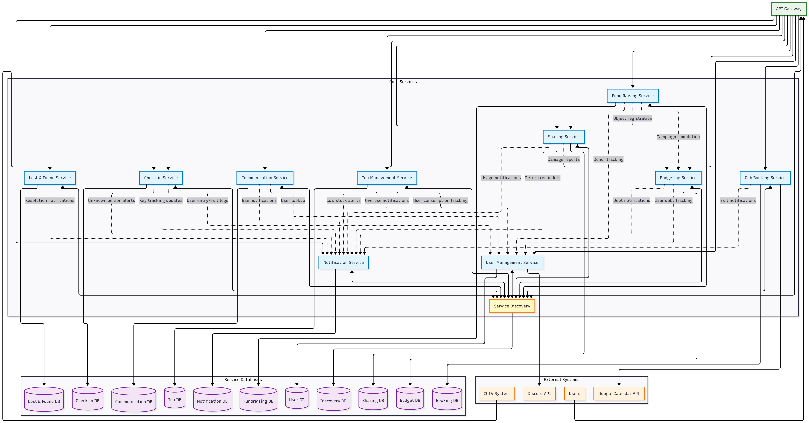

# FAF Management Platform

## Table of Contents
- [Service Boundaries](#service-boundaries)
    - [Services Overview](#services-overview)
        - [Services 1 & 2](#services-1--2)
    - [Architecture Diagram](#architecture-diagram)
- [Technologies and Communication](#technologies-and-communication)
- [Communication Contract](#communication-contract)
  -  [Data Management Across Services](#data-management-across-services)
  -  [Endpoints Definition](#endpoints-definition)
  - [Services Endpoints](#services-eps)
## Service Boundaries

### Services Overview
| Service Name | Core Responsibilities (Boundaries) |
| :--- | :--- |
| **User Management** | • Manages user profiles (name, nickname, role, group).<br>• Central source of truth for user identity.<br>• Integrates with Discord to fetch and sync community member data. |
| **Notification** | • Handles all outgoing communications (e.g., email, Discord DMs).<br>• Sends alerts based on events from other services (e.g., low supplies, new bookings).<br>• Ensures timely and targeted delivery of messages. |
| **Tea Management** | • Tracks inventory levels of all consumables (tea, sugar, cups, markers).<br>• Logs which user consumes which items and when.<br>• Triggers notifications for low stock or excessive resource usage. |
| **Communication** | • Facilitates real-time chat between users (public and private channels).<br>• Allows users to find each other by nickname.<br>• Enforces communication rules through word censorship and user bans. |
| **Cab Booking** | • Manages the schedule for bookable spaces (main room, kitchen).<br>• Prevents scheduling conflicts.<br>• Integrates with Google Calendar to sync events. |
| **Check-in** | • Tracks user presence inside FAF Cab by processing entry and exit events.<br>• Manages a log of one-time guest registrations.<br>• Identifies and alerts admins about unrecognized individuals. |
| **Lost & Found** | • Manages user-generated posts about lost or found items.<br>• Supports comment threads for discussion on each post.<br>• Allows the original poster to mark an issue as resolved. |
| **Budgeting** | • Tracks all financial transactions (donations, spending).<br>• Maintains the FAF NGO treasury balance and a public log.<br>• Manages a debt book for property damage or overuse.<br>• Allows admins to generate financial reports in CSV format. |
| **Fund Raising** | • Allows admins to create and manage fundraising campaigns for specific items.<br>• Tracks user donations towards a goal within a set timeframe.<br>• Orchestrates the registration of newly acquired items into other relevant services (e.g., Sharing, Budgeting). |
| **Sharing** | • Manages the inventory of multi-use, non-consumable items (games, cables, kettles).<br>• Handles the "renting" and "returning" lifecycle of shared objects.<br>• Tracks the state/condition of each item and its ownership (personal or FAF). |
| **External Dependencies** | - **UMS:** validate identities via JWT<br>- ex item <br>- ex item<br>- ex item<br>- ex item | - **UMS:** validate identities via JWT<br>- ex item <br>- ex item<br>- ex item<br>- ex item |
<p align="right"><i>Table 1 – Example Services Boundaries</i></p>


[//]: # (### 7. Lost & Found Service)

[//]: # ()
[//]: # (| **Aspect** | **Description** |)

[//]: # (|------------|-----------------|)

[//]: # (| **Core Responsibility** | Lost item management and community board |)

[//]: # (| **Service Boundaries** | • Post creation for lost/found items<br>• Comment threads under posts<br>• Post resolution tracking<br>• Minimal external dependencies |)

[//]: # (| **Main Features** | • Create posts about lost or found items<br>• Add comments to existing posts<br>• Search posts by item type, date, or status<br>• Mark posts as resolved when item is returned<br>• Basic content filtering<br>• Send notification requests when posts are updated |)

[//]: # ()
[//]: # (### 8. Budgeting Service)

[//]: # ()
[//]: # (| **Aspect** | **Description** |)

[//]: # (|------------|-----------------|)

[//]: # (| **Core Responsibility** | Financial tracking and transparency |)

[//]: # (| **Service Boundaries** | • Treasury balance tracking<br>• Transaction logging<br>• Debt book for damages<br>• CSV report generation<br>• Receives data from other services |)

[//]: # (| **Main Features** | • Track current FAF Cab and FAF NGO balance<br>• Log donations and spending with timestamps<br>• Separate FAF donations from Partner donations<br>• Maintain debt records for broken/overused items<br>• Generate CSV reports for admins<br>• Show transparent spending logs<br>• Receive transaction data from Fund Raising service |)

### Architecture Diagram




## Technologies and Communication

## Technologies and Communication

|   | Services                       | Student Assigned    | Language/Framework   | DB                  | Motivation | Trade-offs         |
|---|--------------------------------|---------------------|----------------------|-----------------------|------------|--------------------|
| 1 | User Management & Notification | Colța Maria         | Typescript (Nest.js) |                     |            |        |
| 2 | Tea Management & Communication | Munteanu Ecaterina  | Golang ()            |                     |            |  |
| 3 | Cab Booking & Check-in         | Friptu Ludmila      | Node.js (Express.js) | PostgreSQL, MongoDB   | Node.js is excellent for I/O-heavy tasks like handling API requests and integrating with Google Calendar. PostgreSQL is chosen for its ACID compliance and reliability, which are critical for preventing double-bookings and maintaining a consistent schedule. And for check-in service, the event-driven, non-blocking nature of Node.js is perfect for processing a real-time feed from a camera. MongoDB is used for its flexible schema and fast write capabilities, making it ideal for storing large volumes of time-series log data (check-ins and check-outs). |     |
| 4 | Lost & Found & Budgeting       | Schipschi Daniel    | C# (ASP.NET Core)    |                     |            |    |
| 5 | Fund Raising & Sharing         | Novac Felicia       | C# (ASP.NET Core)    |                     |            |       |
<p align="right"><i>Table X – Services & Technologies</i></p>

We’ve chosen **REST over HTTP** as the communication pattern for all the services, because it’s quite simple, widely supported, especially across the three chosen stacks. It matches the needs of our business case, such that services must expose predictable, resource-oriented APIs. In this case, we’ll also benefit from its _stateless_ nature, where each call will already contain all the necessary context, simplifying future scaling as mentioned. In addition, REST integrates well with _Swagger_, making it easier to document and test, which in our case is very important you know :)
But of course there are trade-offs. REST is not optimal for real-time features, as in our case is the Communication Service, since it lacks streaming or push support. It also increases coupling because services must call each other directly to complete workflows. Even so, given that most of our operations are transactional, we’re ok )

[//]: # (### 7. Lost & Found Service)

[//]: # ()
[//]: # (**Technology Stack:**)

[//]: # (- Language: C#)

[//]: # (- Framework: ASP.NET Core Web API)

[//]: # (- Database: PostgreSQL)

[//]: # (- Communication: REST with JSON)

[//]: # ()
[//]: # (**Motivation:** C# provides good text handling for post content and comments. PostgreSQL offers full-text search for finding items and handles the post-comment relationships well. REST fits the simple CRUD operations needed.)

[//]: # ()
[//]: # (**Trade-offs:** More setup overhead than lighter alternatives, but provides reliable data handling and built-in validation for user-generated content.)

[//]: # ()
[//]: # (### 8. Budgeting Service)

[//]: # ()
[//]: # (**Technology Stack:**)

[//]: # (- Language: C#)

[//]: # (- Framework: ASP.NET Core Web API)

[//]: # (- Database: PostgreSQL)

[//]: # (- Communication: REST with JSON)

[//]: # ()
[//]: # (**Motivation:** C# decimal type prevents money calculation errors. PostgreSQL ACID compliance ensures financial data integrity. REST provides clear endpoints for different transaction types.)

[//]: # ()
[//]: # (**Trade-offs:** Heavier stack than needed for simple operations, but financial accuracy requirements justify the choice. May need multiple API calls for complex reports.)

## Communication Contract

### Data Management Across Services

We’ve decided that each microservice will be responsible for its own data and will maintain a separate database schema. No service has direct access to another service’s database, instead, data is shared strictly through REST APIs exposed by each service. In this case, each domain entity will be owned exclusively by its responsible service, and when another service will need that data - it will issue a REST request to the owning service.

### Endpoints Definition
All the services in the FAF Cab Management Platform expose RESTful HTTP APIs. They follow consistent “conventions” to keep it easy to integrate with each other.

**Some general conventions:**

* Each service is mounted under `/api/{service}`, where `{service}` is a shortened identifier (e.g., `/api/frs` = Fund Raising Service).

* Requests use `Authorization: Bearer <JWT> issued by the User Management Service. Role checks are enforced per EP.

* All requests and responses use `application/json` content type.

* All datetime fields use `ISO 8601` format in **UTC**.

* Common established error JSON shape: 
````json 
{ 
  "error": "VALIDATION_ERROR", 
  "message": "field X is required"
}
````

### Services EPs

## Booking Service

### Synchronous Communication (REST API)

#### `POST /bookings`

Creates a new booking for a room.

  * **Request Body:**

    ```json
    {
      "userId": "string",
      "room": "string",
      "startTime": "datetime",
      "endTime": "datetime"
    }
    ```

  * **Response (201 Created):**

    ```json
    {
      "bookingId": "string",
      "userId": "string",
      "room": "string",
      "startTime": "datetime",
      "endTime": "datetime",
      "createdAt": "datetime"
    }
    ```

  * **Error Responses:** `400 Bad Request`, `409 Conflict (time slot taken)`

#### `GET /bookings?start={date}&end={date}`

Gets all bookings within a specified date range.

  * **Response (200 OK):**
    ```json
    [
      {
        "bookingId": "string",
        "userId": "string",
        "room": "string",
        "startTime": "datetime",
        "endTime": "datetime"
      }
    ]
    ```

#### `DELETE /bookings/{bookingId}`

Cancels a specific booking.

  * **Response (204 No Content)**
  * **Error Responses:** `403 Forbidden`, `404 Not Found`

-----

### Asynchronous Communication (Events via RabbitMQ)

#### Event: `booking.created`

  * **Payload:** The full booking object, same as the `201 Created` response.
  * **Purpose:** Allows the Notification Service to listen for new bookings and send confirmations.

#### Event: `booking.cancelled`

  * **Payload:**
    ```json
    {
      "bookingId": "string",
      "userId": "string"
    }
    ```
  * **Purpose:** Notifies other services that a booking has been removed.

-----

## 🚪 Check-in Service

### Synchronous Communication (REST API)

#### `GET /status/current`

Gets a list of all users currently inside FAFCab.

  * **Response (200 OK):**
    ```json
    [
      {
        "userId": "string",
        "nickname": "string",
        "checkInTime": "datetime"
      }
    ]
    ```

#### `GET /history/{userId}?start={date}&end={date}`

Gets the entry and exit history for a specific user within a date range.

  * **Response (200 OK):**
    ```json
    [
      {
        "type": "string",
        "timestamp": "datetime"
      }
    ]
    ```
  * **Error Responses:** `404 Not Found`

#### `POST /guest`

Registers a one-time guest.

  * **Request Body:**
    ```json
    {
      "hostUserId": "string",
      "guestName": "string"
    }
    ```
  * **Response (201 Created):**
    ```json
    {
      "guestLogId": "string",
      "guestName": "string",
      "hostUserId": "string",
      "entryTime": "datetime"
    }
    ```
  * **Error Responses:** `400 Bad Request`

-----

### Asynchronous Communication (Events via RabbitMQ)

#### Event: `user.entered`

  * **Payload:**
    ```json
    {
      "userId": "string",
      "timestamp": "datetime"
    }
    ```
  * **Purpose:** Published when the service identifies a known user entering the cab.

#### Event: `user.exited`

  * **Payload:**
    ```json
    {
      "userId": "string",
      "timestamp": "datetime"
    }
    ```
  * **Purpose:** Published when a user leaves the cab.

#### Event: `security.unknown_person`

  * **Payload:**
    ```json
    {
      "timestamp": "datetime",
      "imageUrl": "string"
    }
    ```
  * **Purpose:** Allows the Notification Service to alert admins of a potential security issue.